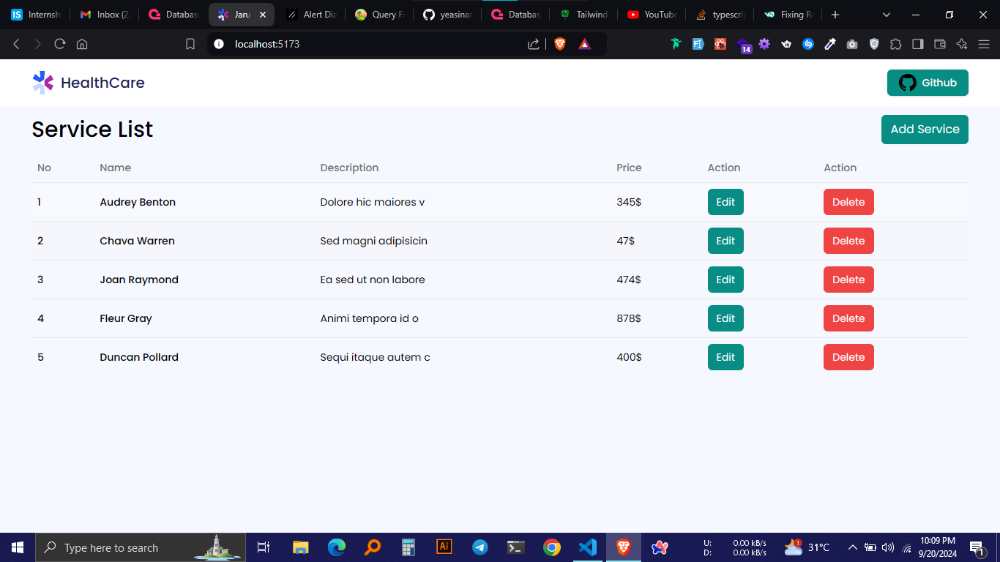

# Jarurat Care

Jarurat Care is a healthcare service management application that allows users to add, edit, and delete healthcare services. The app provides an intuitive interface for managing a list of services with their details.



## Features

- View a list of healthcare services
- Add new services
- Edit existing services
- Delete services
- Responsive design for various screen sizes

## Technologies Used

- **Frontend**: React
- **Styling**: Tailwind CSS, shadcn/ui
- **Backend**: Appwrite
- **Build Tool**: Vite

## Getting Started

### Prerequisites

- Node.js (v14 or later)
- npm or yarn
- Appwrite instance (for backend)

### Installation

1. Clone the repository:

   ```
   git clone https://github.com/yourusername/jarurat-care.git
   cd jarurat-care
   ```

2. Install dependencies:

   ```
   npm install
   # or
   yarn install
   ```

3. Install Appwrite SDK:

   ```
   npm install appwrite
   # or
   yarn add appwrite
   ```

4. Set up environment variables:
   Create a `.env` file in the root directory and add your Appwrite configuration:

   ```
   VITE_APPWRITE_ENDPOINT=your_appwrite_endpoint
   VITE_PROJECT_ID=your_project_id
   VITE_DATABASE_ID=your_database_id
   VITE_COLLECTION_ID=your_collection_id
   ```

   Replace the values with your actual Appwrite configuration.

5. Configure Appwrite (see Appwrite Setup section below)

6. Start the development server:

   ```
   npm run dev
   # or
   yarn dev
   ```

7. Open the provided local URL in your browser to view the app.

## Usage

- To add a new service, click the "Add Service" button and fill in the required information.
- To edit a service, click the "Edit" button next to the service you want to modify.
- To delete a service, click the "Delete" button next to the service you want to remove.

## Appwrite Setup

1. Create an account on [Appwrite](https://appwrite.io/) if you haven't already.
2. Create a new project in the Appwrite console.
3. In your project settings, note down the API Endpoint and Project ID.
4. Create a new database for your services:
   - Go to the "Databases" section in your Appwrite console.
   - Click "Create Database" and give it a name (e.g., "jarurat_care_db").
   - Note down the Database ID.
5. Within the database, create a new collection for storing service information:
   - Click "Create Collection" and name it (e.g., "services").
   - Note down the Collection ID.
6. Set up the necessary attributes for your collection:
   - In the collection settings, go to the "Attributes" tab.
   - Add the following attributes:
     a. name (type: string)
     b. description (type: string)
     c. price (type: number)
7. Configure the appropriate permissions for your collection:
   - Go to the "Settings" tab of your collection.
   - Under "Permissions", set the appropriate read and write access for your application.

## Contributing

Contributions are welcome! Please feel free to submit a Pull Request.

## License

This project is licensed under the MIT License - see the [LICENSE](LICENSE) file for details.

## Acknowledgments

- Thanks to the React, Tailwind CSS, and Appwrite communities for their excellent documentation and resources.
- shadcn/ui for providing beautiful and accessible UI components.
